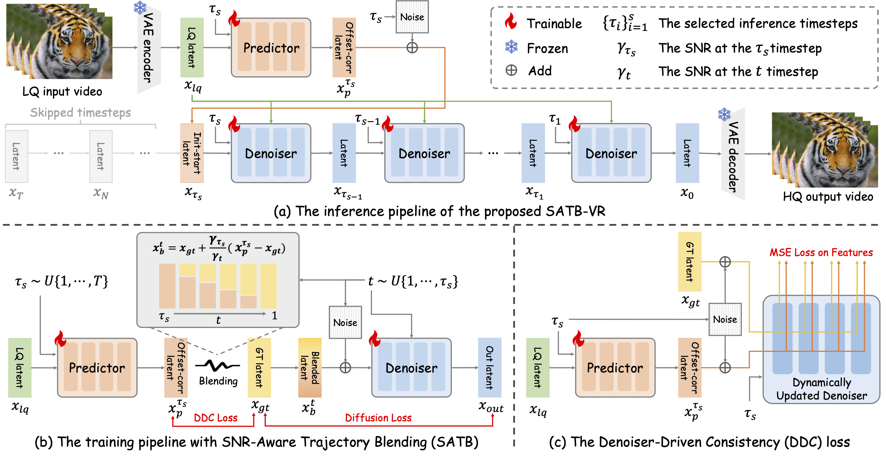

<div align="center">

<h1>
    SATB-VR: Training Few-Step Video Restoration Diffusion Model using SNR-Aware Trajectory Blending
</h1>

<div>
    <a href='https://csbhr.github.io/' target='_blank'>Haoran Bai<sup>1,∗</sup></a>,&emsp;
    <a href='https://scholar.google.com/citations?user=-jJkyWsAAAAJ&hl=zh-CN' target='_blank'>Xiaoxu Chen<sup>1,∗</sup></a>,&emsp;
    <a href='https://scholar.google.com/citations?user=h4iDziYAAAAJ&hl=zh-CN' target='_blank'>Xiaoyu Liu<sup>1,2</sup></a>,&emsp;
    <a href='https://scholar.google.com/citations?user=F554LkQAAAAJ&hl=en' target='_blank'>Zongsheng Yue<sup>3</sup></a>,&emsp;
    <br>
    <a href='https://scholar.google.com/citations?user=brmDxnsAAAAJ&hl=zh-CN' target='_blank'>Sibin Deng<sup>1,&dagger;</sup></a>,&emsp;
    <a href='https://scholar.google.com/citations?user=rUOpCEYAAAAJ&hl=en' target='_blank'>Wangmeng Zuo<sup>2</sup></a>,&emsp;
    <a href='https://scholar.google.com/citations?user=NpTmcKEAAAAJ&hl=en' target='_blank'>Ying Chen<sup>1,&dagger;</sup></a>
</div>
<div>
    <span class="author-block"><sup>1</sup>Alibaba Group</span>&nbsp;&nbsp;
    <span class="author-block"><sup>2</sup>Harbin Institute of Technology</span>&nbsp;&nbsp;
    <span class="author-block"><sup>3</sup>Xi'an Jiaotong University</span><br>
</div>
<div>
    * Equal contribution &nbsp;&nbsp; † Corresponding author
</div>

<a href='https://arxiv.org/abs/2606.28677' target='_blank'>Paper</a> | 
<a href='https://chenxx89.github.io/projects/satb-vr/' target='_blank'>Project Page</a>


<div style="width: 100%; text-align: center; margin:auto;">
    
</div>

For more video visualizations, visit our <a href="https://chenxx89.github.io/projects/satb-vr/" target="_blank">[project page]</a>.

---
</div>


## 🔥 Update
- [2026.07.06] Inference code is released.
- [2026.06.27] This repo is created.
- [2026.06.27] Paper is released at [[Arxiv]](https://arxiv.org/abs/2606.28677).

## 🎬 Overview


## 🔧 Dependencies and Installation
1. Clone Repo
    ```bash
    git clone https://github.com/chenxx89/SATB-VR.git
    cd SATB-VR
    ```

2. Create Conda Environment and Install Dependencies
    ```bash
    # create new conda env
    conda create -n SATB-VR python=3.10
    conda activate SATB-VR

    # install pytorch
    pip install torch==2.6.0 torchvision==0.21.0 torchaudio==2.6.0 --index-url https://download.pytorch.org/whl/cu118

    # install python dependencies
    pip install -r requirements.txt
    ```

3. Download Models
    ```bash
    # download ckpts from huggingface
    python SATB_VR/download_weights.py
    ```

   If you prefer manual download, the models are available at:
   - [CogVideoX1.5-5B](https://huggingface.co/zai-org/CogVideoX1.5-5B)
   - [cogvlm2-llama3-caption](https://huggingface.co/zai-org/cogvlm2-llama3-caption)
   - [SATB-VR](https://huggingface.co/chenxx89/SATB-VR)
   - Put them under the `./ckpts` folder.

   The `./ckpts` directory structure should be arranged as:

    ```
    ├── ckpts
    │   ├── CogVideoX1.5-5B
    │   │   ├── ...
    │   ├── cogvlm2-llama3-caption
    │   │   ├── ...
    │   ├── SATB-VR
    │   │   ├── controlnet
    │   │       ├── config.json
    │   │       ├── diffusion_pytorch_model.safetensors
    │   │   ├── lora_controlnet
    │   │       ├── pytorch_lora_weights.safetensors
    │   │   ├── lora_predictor
    │   │       ├── pytorch_lora_weights.safetensors
    │   │   ├── lora_transformer
    │   │       ├── pytorch_lora_weights.safetensors
    │   │   ├── connectors.pt
    │   │   ├── control_patch_embed.pt
    │   │   ├── negative_prompt_embeds.pt
    │   │   ├── prompt_embeds.pt
    ```


## ☕️ Quick Inference

Run the following commands to try it out:

```shell
python inference.py  \
    --ckpt_path=./ckpts \
    --input_dir=/dir/to/input/videos \
    --output_dir=/dir/to/output/videos \
    --enable_text_encoder \
    --enable_captioner \
    --enable_spatial_tiling \
    --enable_temporal_tiling    \
    --upscale=0 \
    --save_images
```

- `--enable_text_encoder`: Optional, if given, the text encoder will be used
- `--enable_captioner`: Optional, if given, the captioner will be used
- `--enable_spatial_tiling`: Optional, if given, the spatial tiling will be used
- `--enable_temporal_tiling`: Optional, if given, the temporal tiling will be used
- `--upscale`: Optional, if set to 0, the short-size of output videos will be 1024
- `--save_images`: Optional, if given, the video frames will be saved

GPU memory usage:
- For a 121-frame video, it requires approximately **40GB** GPU memory.
- If you want to reduce GPU memory usage, replace `pipe.enable_model_cpu_offload` with `pipe.enable_sequential_cpu_offload` in [`inference.py`](inference.py#L41). GPU memory usage is reduced to **25GB**, but the inference time is longer.
- Use `--enable_spatial_tiling` and `--enable_temporal_tiling` to process long videos with less GPU memory at the cost of longer inference time.

## 📧 Citation

   If you find our repo useful for your research, please consider citing it:

   ```bibtex
    @article{bai2026satb,
    title={SATB-VR: Training Few-Step Video Restoration Diffusion Model using SNR-Aware Trajectory Blending},
    author={Bai, Haoran and Chen, Xiaoxu and Liu, Xiaoyu and Yue, Zongsheng and Deng, Sibin and Zuo, Wangmeng and Chen, Ying},
    journal={arXiv preprint arXiv:2606.28677},
    year={2026}
    }
   ```


## 📄 License
- This repo is built based on [diffusers](https://github.com/huggingface/diffusers/tree/v0.31.0), which is distributed under the terms of the [Apache License 2.0](https://github.com/huggingface/diffusers/blob/main/LICENSE).
- CogVideoX1.5-5B models are distributed under the terms of the [CogVideoX License](https://huggingface.co/zai-org/CogVideoX1.5-5B/blob/main/LICENSE).
- cogvlm2-llama3-caption models are distributed under the terms of the [CogVLM2 License](https://modelscope.cn/models/ZhipuAI/cogvlm2-video-llama3-base/file/view/master?fileName=LICENSE&status=0) and [LLAMA3 License](https://modelscope.cn/models/ZhipuAI/cogvlm2-video-llama3-base/file/view/master?fileName=LLAMA3_LICENSE&status=0).
- SATB-VR models are distributed under the terms of the [Apache License 2.0](https://github.com/huggingface/diffusers/blob/main/LICENSE).

